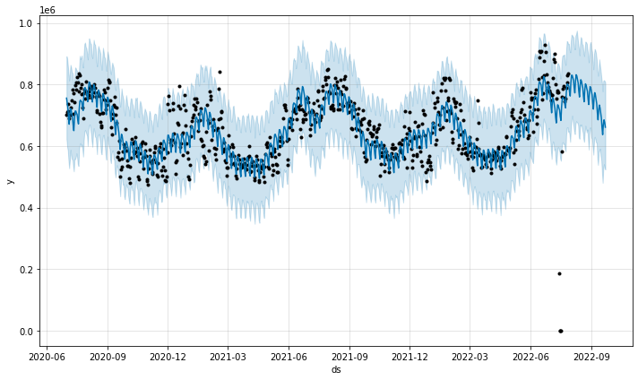

# Solar-Power

## Business Understanding
The Southern Company wants to create a better future by shifting the present energy use. Southern company is looking to understand how much renewable energy would be needed to start dwindling off nonrenewable energy. By understanding this, we can start leaving a smaller carbon footprint thus creating a greener planet.  

#### Stakeholder:
- Southern Company

#### True Business Problem:
- With a recent push for cleaner renewable energy (company name) is seeing an increase in solar panel request. (company name) is looking the potential of solar power and how it can meet the demands of the current power consumption. 

## Modeling Overview
Arima, PMDArima, and FBProphet was used throughout this notebook. FBProphet showed the most promise when forecasting, so all future forecasing was done on the prophet models.

## Data Understanding
Data source: (https://www.eia.gov/opendata/index.php)
The data was pulled in using nine different dataframes. Next, a datetime was used and an index was set to aid in forecasting. To better read the data, it was resampled from hourly to daily.

# Modeling

This is a `FBProphet` model showing the forecast for demand. It follows a trend throughout the year and the model predicted that the demand drop October and November will continue.

# Conclusion
Throughout this notebook, dozens of models were run, and it became clear that this data is volatile when trying to forecast. Even with FBProphet being the better modeling route, no clear model was accurate with its predictions. Doing a deeper dive into parameters might alleviate the volatility that comes with this data but with this data being solely dependent on human behavior that might be impossible to overcome.